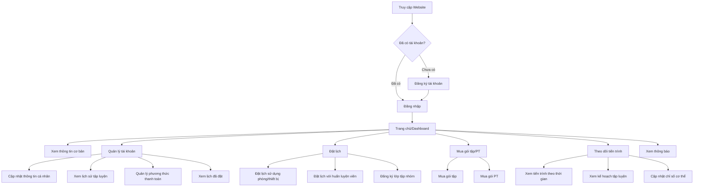
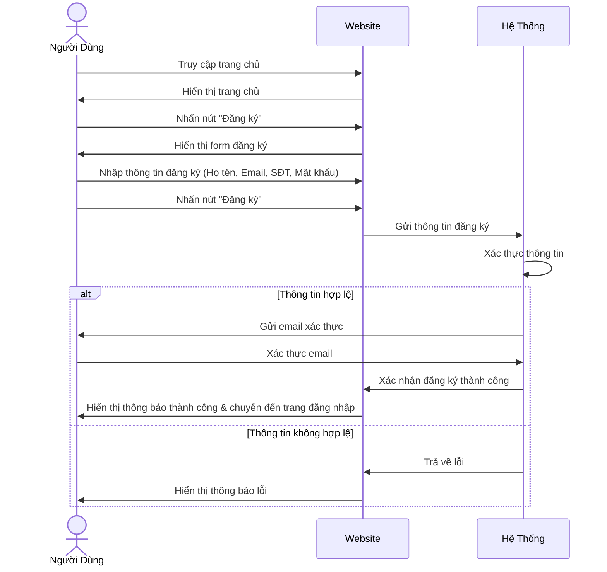
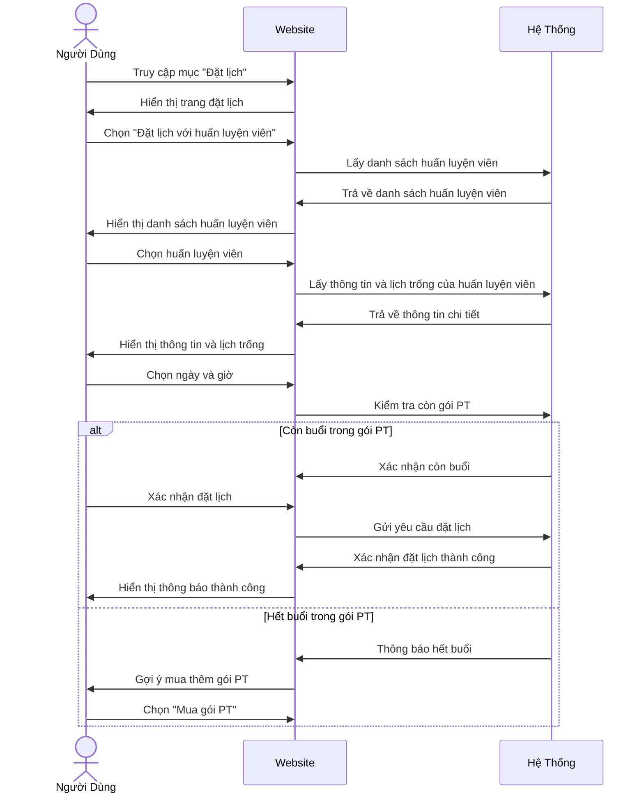
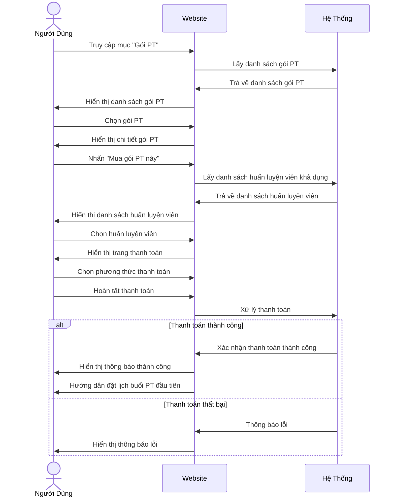

# Quy Trình Người Dùng Sử Dụng Website Hệ Thống Đặt Lịch và Quản Lý Phòng Gym

Tài liệu này mô tả chi tiết quy trình người dùng sử dụng website của hệ thống đặt lịch và quản lý phòng gym, từ góc độ trải nghiệm người dùng. Các quy trình này có thể được sử dụng làm cơ sở để thiết kế giao diện người dùng và tạo hình ảnh minh họa.

## Mục Lục

1. [Quy Trình Tổng Quan](#quy-trình-tổng-quan)
2. [Quy Trình Đăng Ký và Đăng Nhập](#quy-trình-đăng-ký-và-đăng-nhập)
3. [Quy Trình Đặt Lịch Sử Dụng Phòng Gym](#quy-trình-đặt-lịch-sử-dụng-phòng-gym)
4. [Quy Trình Đặt Lịch Với Huấn Luyện Viên](#quy-trình-đặt-lịch-với-huấn-luyện-viên)
5. [Quy Trình Mua Gói Tập](#quy-trình-mua-gói-tập)
6. [Quy Trình Mua Gói PT](#quy-trình-mua-gói-pt)
7. [Quy Trình Quản Lý Tài Khoản Cá Nhân](#quy-trình-quản-lý-tài-khoản-cá-nhân)
8. [Quy Trình Theo Dõi Tiến Trình Tập Luyện](#quy-trình-theo-dõi-tiến-trình-tập-luyện)
9. [Hướng Dẫn Tạo Hình Ảnh Từ Quy Trình](#hướng-dẫn-tạo-hình-ảnh-từ-quy-trình)

## Quy Trình Tổng Quan

Sơ đồ dưới đây thể hiện tổng quan các luồng sử dụng chính của người dùng trên website:



## Quy Trình Đăng Ký và Đăng Nhập

### Quy Trình Đăng Ký



### Chi tiết màn hình đăng ký
1. **Trang chủ**: 
   - Hiển thị nút "Đăng ký" ở góc phải trên cùng
   - Có thể có banner quảng cáo với CTA "Đăng ký ngay"

2. **Form đăng ký**:
   - Trường Họ và tên
   - Trường Email (bắt buộc)
   - Trường Số điện thoại
   - Trường Mật khẩu
   - Trường Xác nhận mật khẩu
   - Checkbox đồng ý điều khoản
   - Nút "Đăng ký"
   - Link "Đã có tài khoản? Đăng nhập"

3. **Màn hình xác nhận**:
   - Thông báo yêu cầu xác thực email
   - Hướng dẫn kiểm tra hộp thư
   - Nút "Gửi lại email xác thực"

4. **Trang thành công**:
   - Thông báo đăng ký thành công
   - Nút "Đăng nhập ngay"

### Quy Trình Đăng Nhập

```mermaid
flowchart TD
    A[Người dùng truy cập website] --> B[Nhấn nút "Đăng nhập"]
    B --> C[Nhập email/username và mật khẩu]
    C --> D{Thông tin đúng?}
    
    D -->|Không| E[Hiển thị thông báo lỗi]
    E --> C
    
    D -->|Có| F[Đăng nhập thành công]
    F --> G[Chuyển đến Dashboard]
    
    H[Quên mật khẩu] --> I[Nhập email]
    I --> J[Gửi link reset mật khẩu]
    J --> K[Nhập mật khẩu mới]
    K --> B
```

### Chi tiết màn hình đăng nhập
1. **Trang đăng nhập**:
   - Logo phòng gym
   - Trường Email/Username
   - Trường Mật khẩu
   - Checkbox "Ghi nhớ đăng nhập"
   - Nút "Đăng nhập"
   - Link "Quên mật khẩu?"
   - Link "Chưa có tài khoản? Đăng ký ngay"

2. **Màn hình quên mật khẩu**:
   - Trường nhập Email
   - Nút "Gửi link đặt lại mật khẩu"
   - Link "Quay lại đăng nhập"

3. **Dashboard sau đăng nhập**:
   - Thanh menu chính
   - Thông tin tài khoản ngắn gọn
   - Lịch tập sắp tới
   - Thông báo mới
   - Tiến trình tập luyện tóm tắt

## Quy Trình Đặt Lịch Sử Dụng Phòng Gym

```mermaid
flowchart TD
    A[Đăng nhập thành công] --> B[Truy cập mục "Đặt lịch"]
    B --> C[Chọn "Đặt lịch sử dụng phòng gym"]
    C --> D[Chọn ngày]
    D --> E[Xem khung giờ và khu vực còn trống]
    E --> F[Chọn khung giờ và khu vực/thiết bị]
    F --> G[Xem thông tin xác nhận]
    G --> H[Nhấn "Xác nhận đặt lịch"]
    H --> I{Đặt lịch thành công?}
    
    I -->|Có| J[Hiển thị thông báo thành công]
    J --> K[Thêm vào lịch cá nhân]
    J --> L[Gửi email xác nhận]
    
    I -->|Không| M[Hiển thị thông báo lỗi]
    M --> N[Gợi ý thời gian thay thế]
    N --> E
```

### Chi tiết màn hình đặt lịch sử dụng phòng gym
1. **Trang đặt lịch chính**:
   - Menu các loại đặt lịch (Phòng/thiết bị, Huấn luyện viên, Lớp tập nhóm)
   - Calendar picker để chọn ngày

2. **Trang chọn khung giờ**:
   - Hiển thị các khung giờ theo ngày đã chọn
   - Màu sắc thể hiện trạng thái (Còn trống/Đã đặt/Đông người)
   - Bộ lọc theo khu vực/thiết bị

3. **Trang xác nhận đặt lịch**:
   - Thông tin đã chọn (Ngày, giờ, khu vực/thiết bị)
   - Chính sách hủy/đổi lịch
   - Nút "Xác nhận đặt lịch"
   - Nút "Quay lại"

4. **Thông báo thành công**:
   - Thông tin đặt lịch
   - Mã QR để check-in
   - Nút "Thêm vào Google Calendar"
   - Nút "Đặt thêm lịch khác"

## Quy Trình Đặt Lịch Với Huấn Luyện Viên



### Chi tiết màn hình đặt lịch với huấn luyện viên
1. **Danh sách huấn luyện viên**:
   - Ảnh đại diện
   - Tên huấn luyện viên
   - Chuyên môn/Thế mạnh
   - Đánh giá (sao)
   - Nút "Xem chi tiết"

2. **Trang chi tiết huấn luyện viên**:
   - Ảnh lớn
   - Tiểu sử, kinh nghiệm, chứng chỉ
   - Video giới thiệu (nếu có)
   - Đánh giá và nhận xét từ hội viên
   - Nút "Đặt lịch với HLV này"

3. **Trang chọn lịch**:
   - Calendar hiển thị lịch trống của huấn luyện viên
   - Chọn ngày và khung giờ
   - Thông tin số buổi còn lại trong gói PT
   - Nút "Xác nhận đặt lịch"

4. **Màn hình xác nhận**:
   - Thông tin buổi tập
   - Thông tin huấn luyện viên
   - Thời gian, địa điểm
   - Nút "Xác nhận"

## Quy Trình Mua Gói Tập

```mermaid
flowchart TD
    A[Đăng nhập thành công] --> B[Truy cập mục "Gói tập"]
    B --> C[Xem danh sách các gói tập]
    C --> D[Chọn gói tập phù hợp]
    D --> E[Xem chi tiết gói tập]
    E --> F[Chọn "Mua gói"]
    F --> G[Chọn thời hạn]
    G --> H[Chọn phương thức thanh toán]
    H --> I[Xác nhận thanh toán]
    I --> J{Thanh toán thành công?}
    
    J -->|Có| K[Hiển thị thông báo thành công]
    K --> L[Cập nhật quyền lợi hội viên]
    K --> M[Gửi email xác nhận]
    
    J -->|Không| N[Hiển thị thông báo lỗi]
    N --> O[Chọn phương thức thanh toán khác]
    O --> I
```

### Chi tiết màn hình mua gói tập
1. **Trang danh sách gói tập**:
   - Danh sách gói tập với các mức giá
   - Bảng so sánh quyền lợi các gói
   - Nhãn "Phổ biến" hoặc "Tiết kiệm" cho gói phù hợp
   - Nút "Xem chi tiết" cho mỗi gói

2. **Trang chi tiết gói tập**:
   - Tên gói
   - Giá và thời hạn
   - Danh sách quyền lợi chi tiết
   - FAQ về gói tập
   - Nút "Mua gói này"

3. **Trang thanh toán**:
   - Tóm tắt thông tin gói đã chọn
   - Chọn thời hạn (1 tháng, 3 tháng, 6 tháng, 1 năm)
   - Hiển thị chiết khấu theo thời hạn
   - Tổng tiền
   - Các phương thức thanh toán
   - Nút "Xác nhận thanh toán"

4. **Trang thanh toán thành công**:
   - Thông báo thanh toán thành công
   - Thông tin gói đã mua
   - Ngày hiệu lực, ngày hết hạn
   - Nút "Đặt lịch ngay"
   - Nút "Về trang chủ"

## Quy Trình Mua Gói PT



### Chi tiết màn hình mua gói PT
1. **Trang danh sách gói PT**:
   - Các gói theo số buổi (8, 12, 24, 48 buổi)
   - Giá tiền và tính năng đi kèm
   - Tỷ lệ tiết kiệm cho các gói nhiều buổi
   - Nút "Chọn gói này"

2. **Trang chọn huấn luyện viên**:
   - Danh sách huấn luyện viên với ảnh và thông tin
   - Bộ lọc theo chuyên môn, kinh nghiệm, đánh giá
   - Nút "Chọn HLV này"

3. **Trang thanh toán gói PT**:
   - Thông tin gói PT đã chọn
   - Thông tin huấn luyện viên
   - Tổng tiền thanh toán
   - Các phương thức thanh toán
   - Tùy chọn thanh toán một lần hoặc trả góp
   - Nút "Xác nhận thanh toán"

4. **Trang xác nhận thành công**:
   - Thông báo mua gói thành công
   - Thông tin về số buổi và thời hạn sử dụng
   - Thông tin liên hệ huấn luyện viên
   - Nút "Đặt lịch buổi đầu tiên"

## Quy Trình Quản Lý Tài Khoản Cá Nhân

```mermaid
flowchart TD
    A[Đăng nhập thành công] --> B[Truy cập "Tài khoản"]
    B --> C{Chọn chức năng}
    
    C --> D[Thông tin cá nhân]
    D --> D1[Xem/Cập nhật thông tin]
    D1 --> D2[Lưu thay đổi]
    
    C --> E[Lịch sử tập luyện]
    E --> E1[Xem lịch sử theo thời gian]
    
    C --> F[Gói tập đã mua]
    F --> F1[Xem chi tiết gói]
    F --> F2[Gia hạn gói]
    
    C --> G[Gói PT đã mua]
    G --> G1[Xem số buổi còn lại]
    G --> G2[Mua thêm buổi]
    
    C --> H[Thanh toán]
    H --> H1[Xem lịch sử thanh toán]
    H --> H2[Quản lý phương thức thanh toán]
    
    C --> I[Đổi mật khẩu]
    I --> I1[Nhập mật khẩu cũ]
    I1 --> I2[Nhập mật khẩu mới]
    I2 --> I3[Xác nhận thay đổi]
```

### Chi tiết màn hình quản lý tài khoản
1. **Trang tài khoản chính**:
   - Menu tab với các chức năng
   - Thông tin cơ bản của người dùng
   - Trạng thái gói tập hiện tại
   - Số buổi PT còn lại

2. **Tab thông tin cá nhân**:
   - Ảnh đại diện
   - Họ tên, Email, SĐT
   - Địa chỉ
   - Ngày sinh
   - Thông tin sức khỏe cơ bản
   - Nút "Cập nhật"

3. **Tab lịch sử tập luyện**:
   - Bảng/Timeline hiển thị các buổi tập
   - Thông tin chi tiết về buổi tập
   - Bộ lọc theo thời gian, loại buổi tập

4. **Tab gói tập**:
   - Thông tin gói hiện tại
   - Ngày bắt đầu, ngày hết hạn
   - Lịch sử sử dụng gói
   - Nút "Gia hạn"

5. **Tab gói PT**:
   - Thông tin gói PT hiện tại
   - Số buổi đã sử dụng, còn lại
   - Huấn luyện viên phụ trách
   - Nút "Mua thêm buổi"

## Quy Trình Theo Dõi Tiến Trình Tập Luyện

```mermaid
flowchart TD
    A[Đăng nhập thành công] --> B[Truy cập "Tiến trình"]
    B --> C{Chọn chức năng}
    
    C --> D[Tổng quan]
    D --> D1[Xem chỉ số và biểu đồ]
    
    C --> E[Chỉ số cơ thể]
    E --> E1[Xem lịch sử các chỉ số]
    E --> E2[Cập nhật chỉ số mới]
    
    C --> F[Kế hoạch tập luyện]
    F --> F1[Xem kế hoạch]
    F --> F2[Đánh dấu hoàn thành]
    
    C --> G[Mục tiêu]
    G --> G1[Xem mục tiêu hiện tại]
    G --> G2[Thiết lập mục tiêu mới]
    G --> G3[Theo dõi tiến độ]
    
    C --> H[Nhật ký tập luyện]
    H --> H1[Ghi nhật ký buổi tập]
    H --> H2[Xem lịch sử nhật ký]
```

### Chi tiết màn hình theo dõi tiến trình
1. **Trang tổng quan**:
   - Dashboard với các widgets
   - Biểu đồ chỉ số theo thời gian
   - Tóm tắt tiến độ mục tiêu
   - Thành tựu đạt được

2. **Tab chỉ số cơ thể**:
   - Biểu đồ cân nặng, BMI, % mỡ cơ thể
   - Form cập nhật chỉ số mới
   - Lịch sử chỉ số theo bảng

3. **Tab kế hoạch tập luyện**:
   - Lịch tập theo tuần
   - Danh sách bài tập cho mỗi buổi
   - Checkbox đánh dấu hoàn thành
   - Video hướng dẫn bài tập

4. **Tab mục tiêu**:
   - Mục tiêu hiện tại
   - Tiến độ dưới dạng % hoặc biểu đồ
   - Form thiết lập mục tiêu mới
   - Lịch sử các mục tiêu đã hoàn thành

## Hướng Dẫn Tạo Hình Ảnh Từ Quy Trình

Dựa trên các quy trình đã mô tả, bạn có thể sử dụng các công cụ sau để tạo hình ảnh minh họa:

### Công cụ thiết kế giao diện:
1. **Figma** (www.figma.com) - Công cụ thiết kế giao diện miễn phí với nhiều tính năng mạnh mẽ
2. **Adobe XD** - Phần mềm thiết kế UI/UX chuyên nghiệp
3. **Sketch** - Phần mềm thiết kế UI/UX dành cho macOS
4. **InVision** - Nền tảng thiết kế prototype tương tác

### Công cụ tạo sơ đồ:
1. **draw.io** (www.draw.io) - Công cụ vẽ sơ đồ trực tuyến miễn phí
2. **Lucidchart** - Nền tảng tạo sơ đồ chuyên nghiệp
3. **Miro** - Bảng trắng cộng tác trực tuyến
4. **Whimsical** - Công cụ tạo flowchart, wireframe trực quan

### Cách tạo hình ảnh:
1. **Wireframes**: Tạo bản phác thảo giao diện cho mỗi màn hình trong quy trình
2. **Mockups**: Thiết kế chi tiết các màn hình với màu sắc, font chữ và bố cục
3. **User Flow Diagram**: Tạo sơ đồ kết nối các màn hình để thể hiện quy trình đầy đủ
4. **Prototype**: Tạo bản mẫu có tính tương tác để mô phỏng trải nghiệm người dùng

### Mẫu hình ảnh cần tạo:
1. **Sơ đồ quy trình tổng thể**: Thể hiện toàn bộ hành trình người dùng từ đăng ký đến sử dụng các tính năng
2. **Wireframe chi tiết**: Thiết kế đơn giản cho từng màn hình
3. **Prototype tương tác**: Mô phỏng luồng chuyển đổi giữa các màn hình
4. **Mockup chất lượng cao**: Thiết kế chi tiết các màn hình chính với đầy đủ các yếu tố UI
