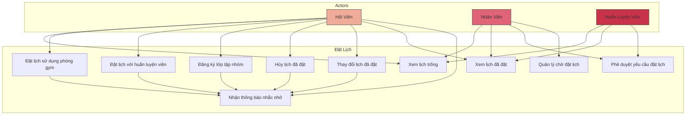
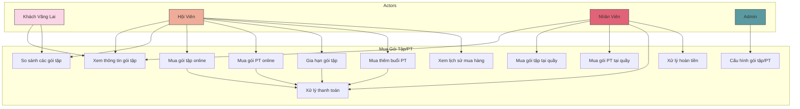
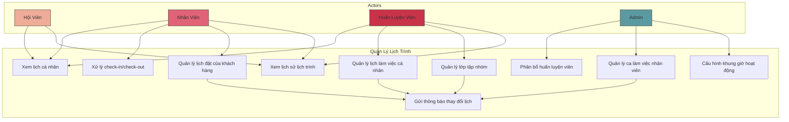
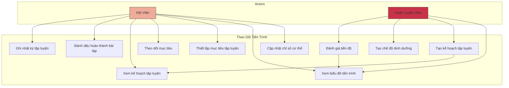
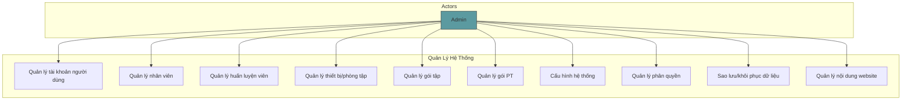
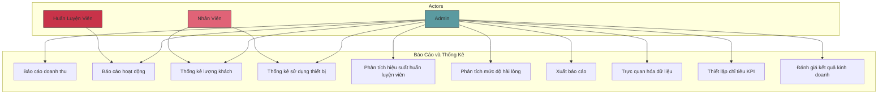

# Biểu Đồ và Mô Tả Use Case Chi Tiết
# Hệ Thống Đặt Lịch và Quản Lý Phòng Gym

Tài liệu này mô tả chi tiết các Use Case của hệ thống đặt lịch và quản lý phòng gym, bao gồm biểu đồ use case và mô tả chi tiết cho từng use case.

## Mục Lục

1. [Biểu Đồ Use Case Tổng Thể](#biểu-đồ-use-case-tổng-thể)
2. [Use Case Chi Tiết: Quản Lý Tài Khoản](#use-case-chi-tiết-quản-lý-tài-khoản)
3. [Use Case Chi Tiết: Đặt Lịch](#use-case-chi-tiết-đặt-lịch)
4. [Use Case Chi Tiết: Mua Gói Tập/PT](#use-case-chi-tiết-mua-gói-tậppt)
5. [Use Case Chi Tiết: Quản Lý Lịch Trình](#use-case-chi-tiết-quản-lý-lịch-trình)
6. [Use Case Chi Tiết: Theo Dõi Tiến Trình](#use-case-chi-tiết-theo-dõi-tiến-trình)
7. [Use Case Chi Tiết: Quản Lý Hệ Thống](#use-case-chi-tiết-quản-lý-hệ-thống)
8. [Use Case Chi Tiết: Báo Cáo và Thống Kê](#use-case-chi-tiết-báo-cáo-và-thống-kê)
9. [Mô Tả Chi Tiết Các Use Case](#mô-tả-chi-tiết-các-use-case)

## Biểu Đồ Use Case Tổng Thể

Biểu đồ dưới đây mô tả tổng quan các use case chính của hệ thống và mối quan hệ với các actor:

```mermaid
graph TB
    subgraph Actors
        KVL[Khách Vãng Lai]
        HV[Hội Viên]
        NV[Nhân Viên]
        HLV[Huấn Luyện Viên]
        AD[Admin]
    end
    
    subgraph "Hệ Thống Đặt Lịch và Quản Lý Phòng Gym"
        subgraph "Quản Lý Tài Khoản"
            UC1[Đăng ký tài khoản]
            UC2[Đăng nhập]
            UC3[Quản lý thông tin cá nhân]
            UC4[Khôi phục mật khẩu]
        end
        
        subgraph "Đặt Lịch"
            UC5[Đặt lịch sử dụng phòng gym]
            UC6[Đặt lịch với huấn luyện viên]
            UC7[Đăng ký lớp tập nhóm]
            UC8[Hủy/thay đổi lịch]
        end
        
        subgraph "Mua Gói Tập/PT"
            UC9[Xem thông tin gói tập]
            UC10[Mua gói tập]
            UC11[Mua gói PT]
            UC12[Gia hạn gói]
        end
        
        subgraph "Quản Lý Lịch Trình"
            UC13[Quản lý lịch đặt của khách hàng]
            UC14[Quản lý lịch làm việc cá nhân]
            UC15[Quản lý lớp tập nhóm]
            UC16[Xử lý check-in/check-out]
        end
        
        subgraph "Theo Dõi Tiến Trình"
            UC17[Theo dõi chỉ số cơ thể]
            UC18[Quản lý mục tiêu tập luyện]
            UC19[Xem kế hoạch tập luyện]
            UC20[Ghi nhật ký tập luyện]
        end
        
        subgraph "Quản Lý Hệ Thống"
            UC21[Quản lý người dùng]
            UC22[Quản lý nhân viên/huấn luyện viên]
            UC23[Quản lý thiết bị/phòng tập]
            UC24[Cấu hình hệ thống]
        end
        
        subgraph "Báo Cáo và Thống Kê"
            UC25[Báo cáo doanh thu]
            UC26[Báo cáo hoạt động]
            UC27[Thống kê lượng khách]
            UC28[Phân tích hiệu suất]
        end
    end
    
    KVL --> UC1
    KVL --> UC2
    KVL --> UC4
    KVL --> UC9
    
    HV --> UC2
    HV --> UC3
    HV --> UC4
    HV --> UC5
    HV --> UC6
    HV --> UC7
    HV --> UC8
    HV --> UC9
    HV --> UC10
    HV --> UC11
    HV --> UC12
    HV --> UC17
    HV --> UC18
    HV --> UC19
    HV --> UC20
    
    NV --> UC2
    NV --> UC3
    NV --> UC13
    NV --> UC15
    NV --> UC16
    
    HLV --> UC2
    HLV --> UC3
    HLV --> UC14
    HLV --> UC15
    HLV --> UC17
    HLV --> UC18
    HLV --> UC19
    
    AD --> UC2
    AD --> UC3
    AD --> UC21
    AD --> UC22
    AD --> UC23
    AD --> UC24
    AD --> UC25
    AD --> UC26
    AD --> UC27
    AD --> UC28
    
    style KVL fill:#f9d5e5,stroke:#333,stroke-width:1px
    style HV fill:#eeac99,stroke:#333,stroke-width:1px
    style NV fill:#e06377,stroke:#333,stroke-width:1px
    style HLV fill:#c83349,stroke:#333,stroke-width:1px
    style AD fill:#5b9aa0,stroke:#333,stroke-width:1px
```

## Use Case Chi Tiết: Quản Lý Tài Khoản

```mermaid
graph TB
    subgraph Actors
        KVL[Khách Vãng Lai]
        HV[Hội Viên]
        NV[Nhân Viên]
        HLV[Huấn Luyện Viên]
        AD[Admin]
    end
    
    subgraph "Quản Lý Tài Khoản"
        UC1[Đăng ký tài khoản]
        UC2[Đăng nhập]
        UC3[Quản lý thông tin cá nhân]
        UC4[Khôi phục mật khẩu]
        UC5[Đổi mật khẩu]
        UC6[Quản lý phương thức thanh toán]
        UC7[Xem lịch sử hoạt động]
        UC8[Quản lý thông báo]
        UC9[Xác thực email/OTP]
        UC10[Đăng xuất]
    end
    
    KVL --> UC1
    KVL --> UC2
    KVL --> UC4
    KVL --> UC9
    
    HV --> UC2
    HV --> UC3
    HV --> UC4
    HV --> UC5
    HV --> UC6
    HV --> UC7
    HV --> UC8
    HV --> UC9
    HV --> UC10
    
    NV --> UC2
    NV --> UC3
    NV --> UC4
    NV --> UC5
    NV --> UC7
    NV --> UC8
    NV --> UC10
    
    HLV --> UC2
    HLV --> UC3
    HLV --> UC4
    HLV --> UC5
    HLV --> UC6
    HLV --> UC7
    HLV --> UC8
    HLV --> UC10
    
    AD --> UC2
    AD --> UC3
    AD --> UC4
    AD --> UC5
    AD --> UC7
    AD --> UC8
    AD --> UC10
    
    style KVL fill:#f9d5e5,stroke:#333,stroke-width:1px
    style HV fill:#eeac99,stroke:#333,stroke-width:1px
    style NV fill:#e06377,stroke:#333,stroke-width:1px
    style HLV fill:#c83349,stroke:#333,stroke-width:1px
    style AD fill:#5b9aa0,stroke:#333,stroke-width:1px
```

## Use Case Chi Tiết: Đặt Lịch

## Use Case Chi Tiết: Mua Gói Tập/PT

## Use Case Chi Tiết: Quản Lý Lịch Trình

## Use Case Chi Tiết: Theo Dõi Tiến Trình

## Use Case Chi Tiết: Quản Lý Hệ Thống

## Use Case Chi Tiết: Báo Cáo và Thống Kê

## Mô Tả Chi Tiết Các Use Case

### 1. Đăng Ký Tài Khoản

**ID**: UC-01  
**Tác nhân chính**: Khách Vãng Lai  
**Mục đích**: Tạo tài khoản mới trên hệ thống  
**Tiền điều kiện**: Người dùng chưa có tài khoản  
**Hậu điều kiện**: Người dùng có tài khoản mới và có thể đăng nhập  

**Luồng sự kiện chính**:
1. Người dùng truy cập trang đăng ký
2. Hệ thống hiển thị form đăng ký
3. Người dùng nhập thông tin cá nhân (họ tên, email, số điện thoại, mật khẩu)
4. Người dùng đồng ý với điều khoản sử dụng
5. Người dùng nhấn nút "Đăng ký"
6. Hệ thống xác thực thông tin đăng ký
7. Hệ thống gửi email xác thực đến email đã đăng ký
8. Người dùng mở email và xác thực tài khoản
9. Hệ thống kích hoạt tài khoản
10. Hệ thống hiển thị thông báo đăng ký thành công
11. Hệ thống chuyển hướng đến trang đăng nhập

**Luồng sự kiện thay thế**:
- 6a. Thông tin đăng ký không hợp lệ:
  1. Hệ thống hiển thị thông báo lỗi
  2. Quay lại bước 3
- 6b. Email đã được sử dụng:
  1. Hệ thống hiển thị thông báo lỗi
  2. Gợi ý chuyển đến trang đăng nhập hoặc khôi phục mật khẩu
- 8a. Người dùng không xác thực email trong 24 giờ:
  1. Hệ thống gửi email nhắc nhở xác thực
  2. Nếu không xác thực trong 72 giờ, tài khoản sẽ bị xóa tạm thời

### 2. Đăng Nhập

**ID**: UC-02  
**Tác nhân chính**: Tất cả người dùng (Khách Vãng Lai, Hội Viên, Nhân Viên, Huấn Luyện Viên, Admin)  
**Mục đích**: Đăng nhập vào hệ thống  
**Tiền điều kiện**: Người dùng đã có tài khoản  
**Hậu điều kiện**: Người dùng đăng nhập thành công và truy cập được vào hệ thống  

**Luồng sự kiện chính**:
1. Người dùng truy cập trang đăng nhập
2. Hệ thống hiển thị form đăng nhập
3. Người dùng nhập email/username và mật khẩu
4. Người dùng nhấn nút "Đăng nhập"
5. Hệ thống xác thực thông tin đăng nhập
6. Hệ thống tạo phiên đăng nhập và lưu token
7. Hệ thống chuyển hướng đến trang chủ/dashboard tương ứng với vai trò người dùng

**Luồng sự kiện thay thế**:
- 5a. Thông tin đăng nhập không chính xác:
  1. Hệ thống hiển thị thông báo lỗi
  2. Quay lại bước 3
- 5b. Tài khoản đã bị khóa:
  1. Hệ thống hiển thị thông báo tài khoản bị khóa
  2. Hệ thống hiển thị hướng dẫn liên hệ hỗ trợ
- 5c. Tài khoản chưa được xác thực:
  1. Hệ thống hiển thị thông báo cần xác thực tài khoản
  2. Hệ thống cung cấp tùy chọn gửi lại email xác thực

### 3. Đặt Lịch Sử Dụng Phòng Gym

**ID**: UC-05  
**Tác nhân chính**: Hội Viên  
**Mục đích**: Đặt lịch sử dụng phòng gym và thiết bị  
**Tiền điều kiện**: Hội viên đã đăng nhập và có gói tập hợp lệ  
**Hậu điều kiện**: Hội viên đặt lịch thành công và nhận được xác nhận  

**Luồng sự kiện chính**:
1. Hội viên truy cập mục "Đặt lịch"
2. Hội viên chọn "Đặt lịch sử dụng phòng gym"
3. Hệ thống hiển thị calendar để chọn ngày
4. Hội viên chọn ngày muốn đặt lịch
5. Hệ thống hiển thị các khung giờ và khu vực/thiết bị có sẵn
6. Hội viên chọn khung giờ và khu vực/thiết bị mong muốn
7. Hệ thống hiển thị trang xác nhận đặt lịch
8. Hội viên nhấn "Xác nhận đặt lịch"
9. Hệ thống kiểm tra và xử lý yêu cầu đặt lịch
10. Hệ thống hiển thị thông báo đặt lịch thành công
11. Hệ thống gửi email xác nhận đặt lịch
12. Hệ thống cập nhật lịch cá nhân của hội viên

**Luồng sự kiện thay thế**:
- 5a. Không có khung giờ/khu vực nào có sẵn:
  1. Hệ thống hiển thị thông báo không có lịch trống
  2. Gợi ý chọn ngày khác hoặc hiển thị các ngày có lịch trống
- 9a. Khung giờ vừa được người khác đặt:
  1. Hệ thống hiển thị thông báo khung giờ không còn trống
  2. Gợi ý các khung giờ khác gần với thời gian đã chọn
  3. Quay lại bước 5
- 9b. Hội viên đã đặt lịch vào cùng khung giờ:
  1. Hệ thống hiển thị thông báo trùng lịch
  2. Gợi ý hủy lịch cũ hoặc chọn thời gian khác

### 4. Mua Gói Tập

**ID**: UC-10  
**Tác nhân chính**: Hội Viên  
**Mục đích**: Mua gói tập mới hoặc gia hạn gói tập  
**Tiền điều kiện**: Hội viên đã đăng nhập  
**Hậu điều kiện**: Hội viên mua gói tập thành công và nhận được xác nhận  

**Luồng sự kiện chính**:
1. Hội viên truy cập mục "Gói tập"
2. Hệ thống hiển thị danh sách các gói tập
3. Hội viên chọn gói tập phù hợp
4. Hệ thống hiển thị thông tin chi tiết về gói tập
5. Hội viên nhấn "Mua gói này"
6. Hệ thống hiển thị các tùy chọn thời hạn (1 tháng, 3 tháng, 6 tháng, 1 năm)
7. Hội viên chọn thời hạn mong muốn
8. Hệ thống hiển thị trang thanh toán
9. Hội viên chọn phương thức thanh toán
10. Hội viên hoàn tất thanh toán
11. Hệ thống xử lý giao dịch thanh toán
12. Hệ thống cập nhật quyền lợi hội viên
13. Hệ thống hiển thị thông báo mua gói thành công
14. Hệ thống gửi email xác nhận với thông tin gói tập

**Luồng sự kiện thay thế**:
- 11a. Thanh toán không thành công:
  1. Hệ thống hiển thị thông báo lỗi thanh toán
  2. Gợi ý thử lại hoặc chọn phương thức thanh toán khác
  3. Quay lại bước 9
- 7a. Hội viên đã có gói tập đang hoạt động:
  1. Hệ thống hiển thị thông tin về gói tập hiện tại
  2. Hệ thống cung cấp tùy chọn gia hạn gói hiện tại hoặc nâng cấp gói

### 5. Quản Lý Gói Tập và Gói PT

**ID**: UC-23  
**Tác nhân chính**: Admin  
**Mục đích**: Quản lý thông tin gói tập và gói PT trong hệ thống  
**Tiền điều kiện**: Admin đã đăng nhập  
**Hậu điều kiện**: Thông tin gói tập/PT được cập nhật trong hệ thống  

**Luồng sự kiện chính**:
1. Admin truy cập mục "Quản lý gói tập/PT"
2. Hệ thống hiển thị danh sách gói tập và gói PT hiện có
3. Admin có thể thực hiện các thao tác:
   a. Xem chi tiết gói
   b. Thêm gói mới
   c. Chỉnh sửa gói hiện có
   d. Vô hiệu hóa/kích hoạt gói
4. Nếu chọn thêm gói mới:
   a. Hệ thống hiển thị form thêm gói
   b. Admin nhập thông tin gói (tên, mô tả, giá, thời hạn, quyền lợi)
   c. Admin nhấn "Lưu"
5. Nếu chọn chỉnh sửa gói:
   a. Hệ thống hiển thị form chỉnh sửa với thông tin gói hiện tại
   b. Admin cập nhật thông tin
   c. Admin nhấn "Lưu thay đổi"
6. Hệ thống xác nhận thay đổi
7. Hệ thống cập nhật thông tin gói trong cơ sở dữ liệu

**Luồng sự kiện thay thế**:
- 4c/5c. Thông tin không hợp lệ:
  1. Hệ thống hiển thị thông báo lỗi
  2. Yêu cầu admin nhập lại thông tin hợp lệ
- 5d. Admin vô hiệu hóa gói đang có người sử dụng:
  1. Hệ thống hiển thị cảnh báo và yêu cầu xác nhận
  2. Nếu xác nhận, gói sẽ không còn hiển thị cho người dùng mới nhưng vẫn áp dụng cho người đang sử dụng

### 6. Tạo Kế Hoạch Tập Luyện

**ID**: UC-17  
**Tác nhân chính**: Huấn Luyện Viên  
**Mục đích**: Tạo kế hoạch tập luyện cá nhân hóa cho hội viên  
**Tiền điều kiện**: Huấn luyện viên đã đăng nhập, hội viên đã mua gói PT  
**Hậu điều kiện**: Kế hoạch tập luyện được tạo và gửi đến hội viên  

**Luồng sự kiện chính**:
1. Huấn luyện viên truy cập mục "Quản lý khách hàng"
2. Hệ thống hiển thị danh sách khách hàng của huấn luyện viên
3. Huấn luyện viên chọn khách hàng cần tạo kế hoạch
4. Hệ thống hiển thị thông tin chi tiết về khách hàng (chỉ số cơ thể, mục tiêu, tiền sử)
5. Huấn luyện viên chọn "Tạo kế hoạch tập luyện"
6. Hệ thống hiển thị giao diện tạo kế hoạch
7. Huấn luyện viên tạo kế hoạch tập luyện:
   a. Chọn thời gian (tuần/tháng)
   b. Thêm các bài tập cho từng ngày
   c. Thiết lập cường độ, số lần lặp, số hiệp
   d. Thêm ghi chú cho từng bài tập
8. Huấn luyện viên nhấn "Lưu kế hoạch"
9. Hệ thống lưu kế hoạch và gửi thông báo đến hội viên
10. Hệ thống hiển thị thông báo tạo kế hoạch thành công

**Luồng sự kiện thay thế**:
- 7e. Huấn luyện viên sử dụng kế hoạch mẫu:
  1. Huấn luyện viên chọn "Sử dụng kế hoạch mẫu"
  2. Hệ thống hiển thị danh sách kế hoạch mẫu
  3. Huấn luyện viên chọn kế hoạch mẫu phù hợp
  4. Huấn luyện viên điều chỉnh kế hoạch theo nhu cầu của khách hàng
  5. Quay lại bước 8
- 8a. Huấn luyện viên lưu kế hoạch dưới dạng nháp:
  1. Huấn luyện viên chọn "Lưu nháp"
  2. Hệ thống lưu kế hoạch nhưng không gửi thông báo đến hội viên

### 7. Xử Lý Check-In và Check-Out

**ID**: UC-30  
**Tác nhân chính**: Nhân Viên  
**Mục đích**: Xử lý việc check-in và check-out của hội viên tại phòng gym  
**Tiền điều kiện**: Nhân viên đã đăng nhập  
**Hậu điều kiện**: Hội viên được check-in/check-out thành công và hệ thống ghi nhận  

**Luồng sự kiện chính**:
1. Hội viên đến phòng gym và cung cấp thẻ thành viên/mã QR
2. Nhân viên truy cập mục "Check-in/Check-out"
3. Nhân viên quét thẻ/mã QR hoặc nhập mã hội viên
4. Hệ thống kiểm tra thông tin hội viên
5. Hệ thống hiển thị thông tin hội viên và trạng thái gói tập
6. Nhân viên xác nhận check-in
7. Hệ thống ghi nhận thời gian check-in
8. Hệ thống hiển thị thông báo check-in thành công
9. Khi hội viên rời đi:
   a. Nhân viên tìm kiếm hội viên trong danh sách đang tập
   b. Nhân viên xác nhận check-out
   c. Hệ thống ghi nhận thời gian check-out
   d. Hệ thống cập nhật lịch sử tập luyện của hội viên

**Luồng sự kiện thay thế**:
- 5a. Gói tập đã hết hạn:
  1. Hệ thống hiển thị thông báo gói tập hết hạn
  2. Nhân viên thông báo cho hội viên
  3. Hệ thống gợi ý gia hạn gói tập
- 5b. Hội viên đã check-in (khi thực hiện check-in):
  1. Hệ thống hiển thị thông báo hội viên đã check-in trước đó
  2. Nhân viên có thể xác nhận lại hoặc chuyển sang check-out
- 5c. Hội viên chưa check-in (khi thực hiện check-out):
  1. Hệ thống hiển thị thông báo hội viên chưa check-in
  2. Nhân viên có thể xác nhận check-in trước, sau đó check-out

### 8. Tạo Báo Cáo Doanh Thu

**ID**: UC-40  
**Tác nhân chính**: Admin  
**Mục đích**: Tạo và xem báo cáo doanh thu  
**Tiền điều kiện**: Admin đã đăng nhập  
**Hậu điều kiện**: Báo cáo doanh thu được tạo và hiển thị  

**Luồng sự kiện chính**:
1. Admin truy cập mục "Báo cáo" > "Doanh thu"
2. Hệ thống hiển thị giao diện báo cáo doanh thu
3. Admin chọn các tham số báo cáo:
   a. Thời gian (ngày, tuần, tháng, quý, năm)
   b. Loại doanh thu (gói tập, gói PT, các dịch vụ khác)
   c. Chi nhánh (nếu có nhiều chi nhánh)
4. Admin nhấn "Tạo báo cáo"
5. Hệ thống tính toán và tổng hợp dữ liệu
6. Hệ thống hiển thị báo cáo doanh thu với các biểu đồ và bảng số liệu
7. Admin có thể:
   a. Xem chi tiết từng mục doanh thu
   b. So sánh với kỳ trước hoặc cùng kỳ năm trước
   c. Xuất báo cáo ra file (PDF, Excel, CSV)

**Luồng sự kiện thay thế**:
- 5a. Không có dữ liệu cho khoảng thời gian đã chọn:
  1. Hệ thống hiển thị thông báo không có dữ liệu
  2. Gợi ý chọn khoảng thời gian khác
- 7d. Admin thiết lập báo cáo tự động:
  1. Admin chọn "Thiết lập báo cáo tự động"
  2. Admin chọn tần suất (hàng ngày, hàng tuần, hàng tháng)
  3. Admin chọn người nhận báo cáo
  4. Admin nhấn "Lưu thiết lập"
  5. Hệ thống sẽ tự động gửi báo cáo theo lịch đã thiết lập
