# Quy Trình Hoạt Động Của Hệ Thống Đặt Lịch và Quản Lý Phòng Gym

Tài liệu này mô tả trực quan các quy trình hoạt động chính của hệ thống, giúp người đọc hiểu rõ luồng hoạt động và tương tác giữa các thành phần trong hệ thống.

## Mục Lục

1. [Tổng Quan Kiến Trúc Hệ Thống](#tổng-quan-kiến-trúc-hệ-thống)
2. [Quy Trình Đăng Ký và Đăng Nhập](#quy-trình-đăng-ký-và-đăng-nhập)
3. [Quy Trình Đặt Lịch Sử Dụng Phòng Gym](#quy-trình-đặt-lịch-sử-dụng-phòng-gym)
4. [Quy Trình Đặt Lịch Với Huấn Luyện Viên](#quy-trình-đặt-lịch-với-huấn-luyện-viên)
5. [Quy Trình Mua Gói Tập](#quy-trình-mua-gói-tập)
6. [Quy Trình Mua Gói PT](#quy-trình-mua-gói-pt)
7. [Quy Trình Check-in và Check-out](#quy-trình-check-in-và-check-out)
8. [Quy Trình Thông Báo](#quy-trình-thông-báo)
9. [Quy Trình Báo Cáo và Thống Kê](#quy-trình-báo-cáo-và-thống-kê)
10. [Tương Tác Giữa Các Microservices](#tương-tác-giữa-các-microservices)

## Tổng Quan Kiến Trúc Hệ Thống

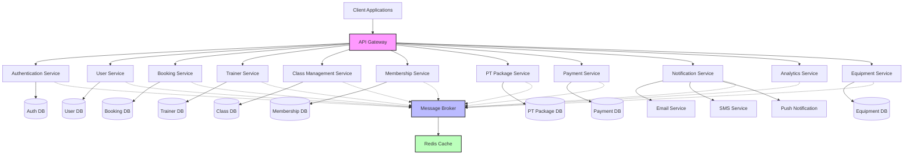

Hệ thống được xây dựng theo kiến trúc microservices với các thành phần chính:
- **API Gateway**: Điểm vào của hệ thống, điều hướng các request tới microservice phù hợp
- **Microservices**: Mỗi service chịu trách nhiệm cho một nghiệp vụ cụ thể và có cơ sở dữ liệu riêng
- **Message Broker**: Hỗ trợ giao tiếp bất đồng bộ giữa các microservices
- **Cache**: Lưu trữ tạm thời dữ liệu thường xuyên truy cập để tăng hiệu suất

## Quy Trình Đăng Ký và Đăng Nhập

### Quy Trình Đăng Ký

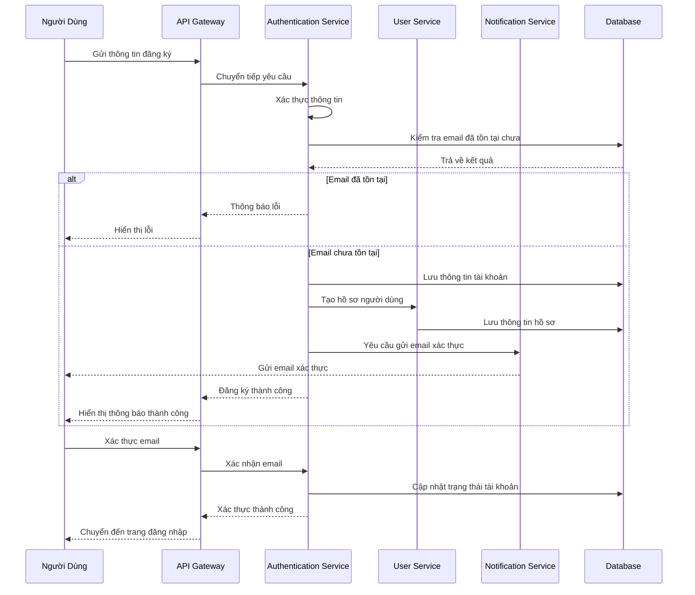

### Quy Trình Đăng Nhập

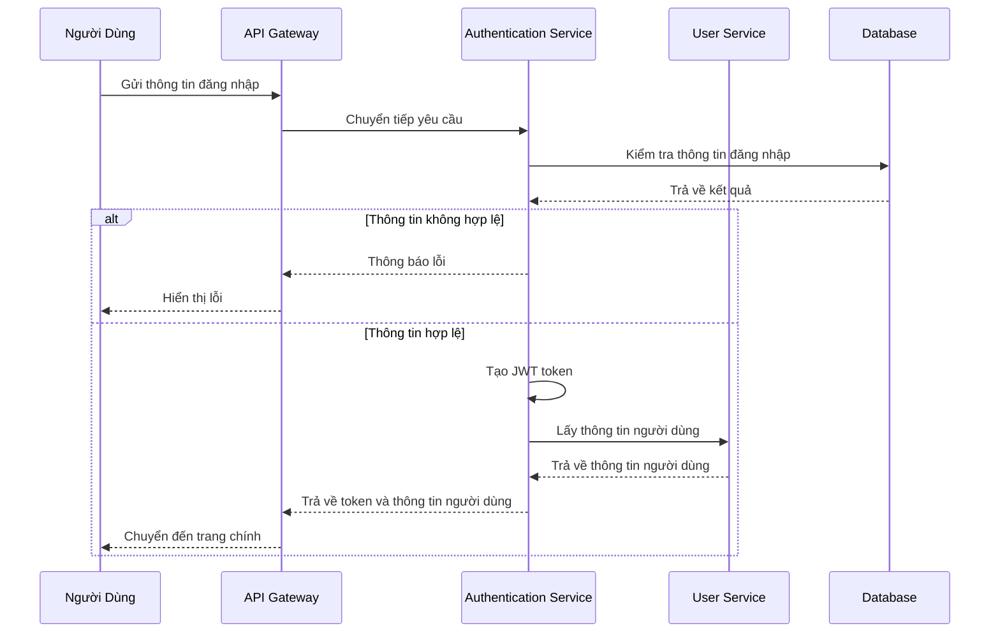

## Quy Trình Đặt Lịch Sử Dụng Phòng Gym

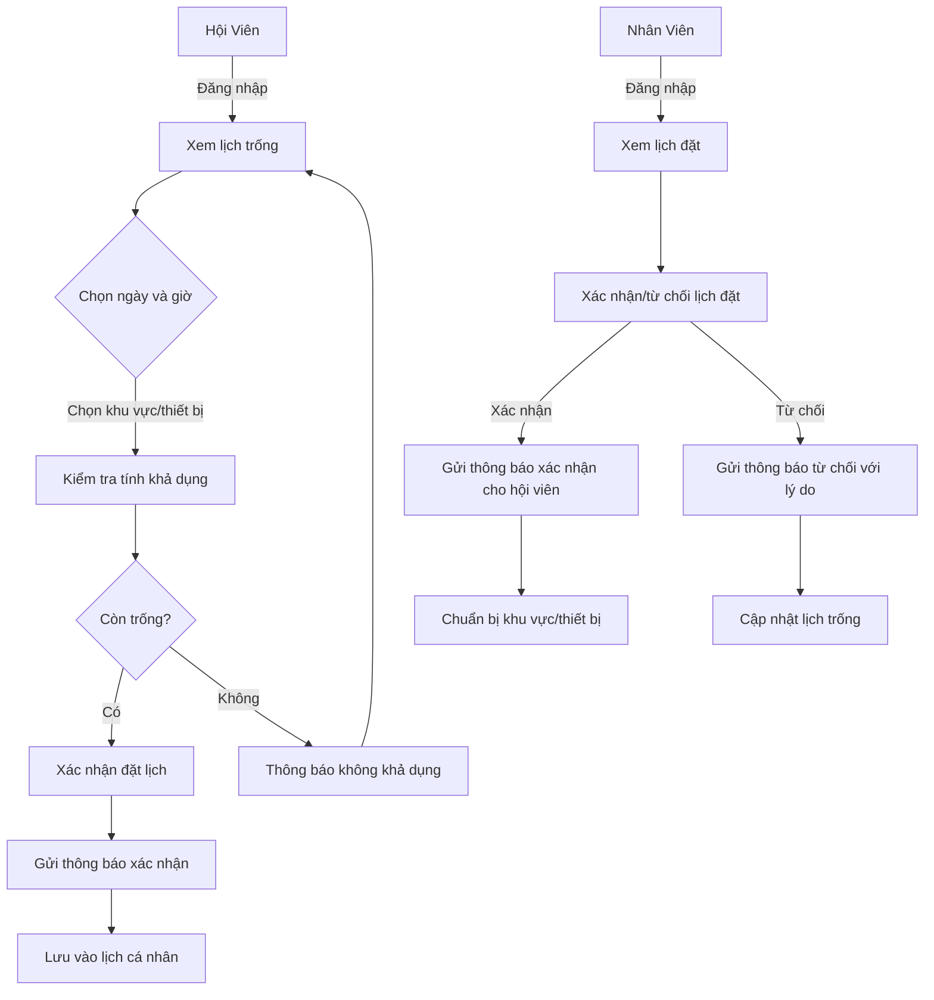

## Quy Trình Đặt Lịch Với Huấn Luyện Viên

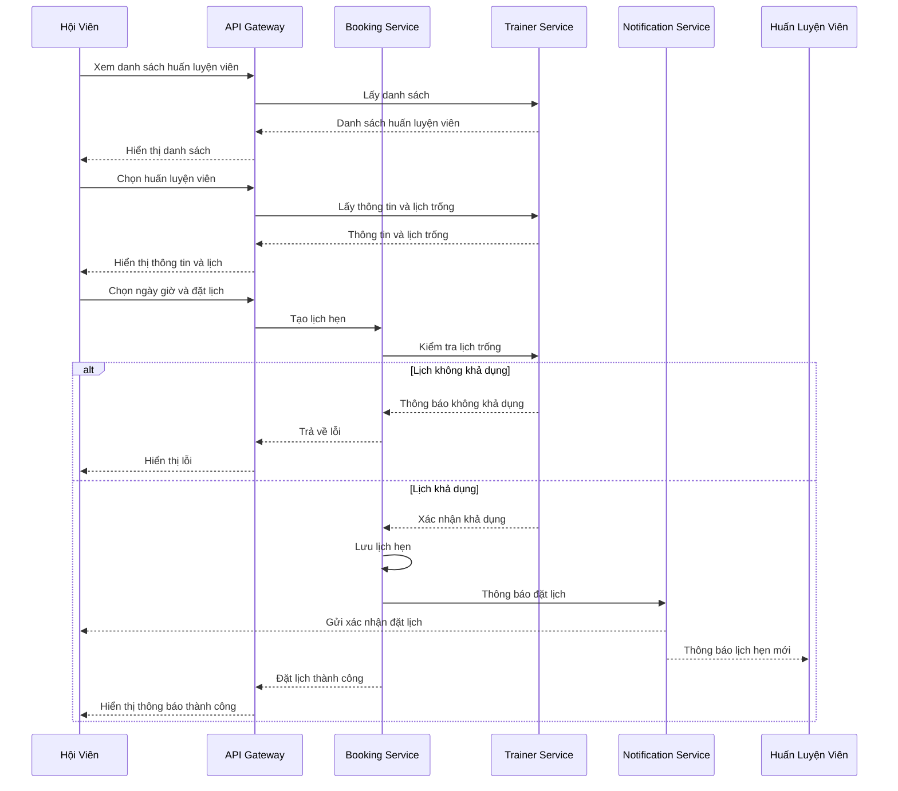

## Quy Trình Mua Gói Tập

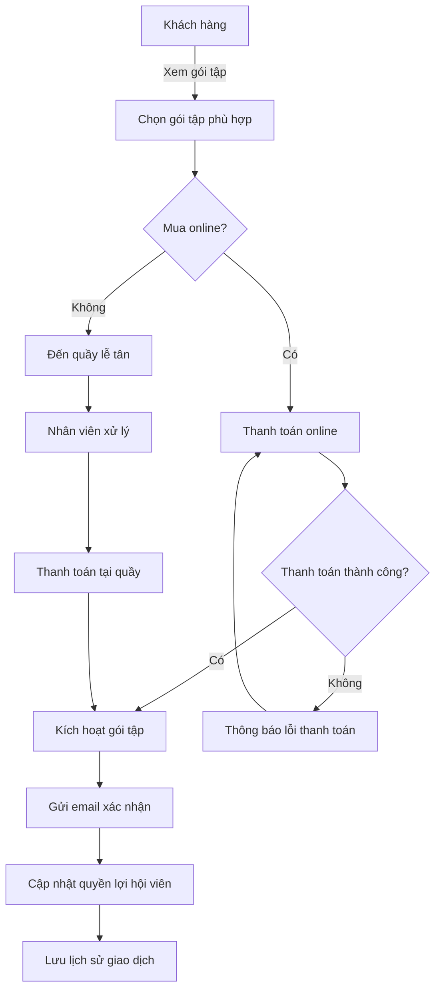

## Quy Trình Mua Gói PT

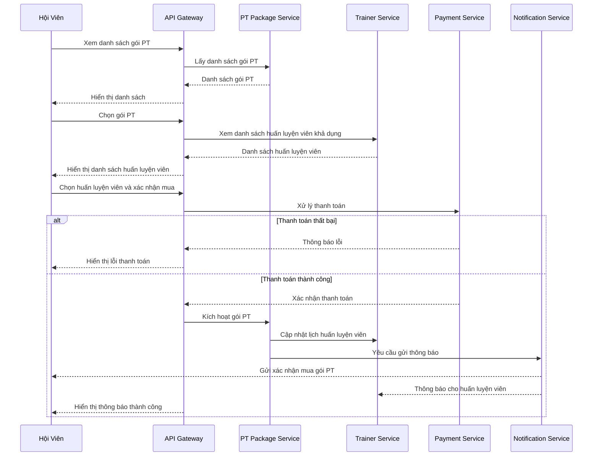

## Quy Trình Check-in và Check-out

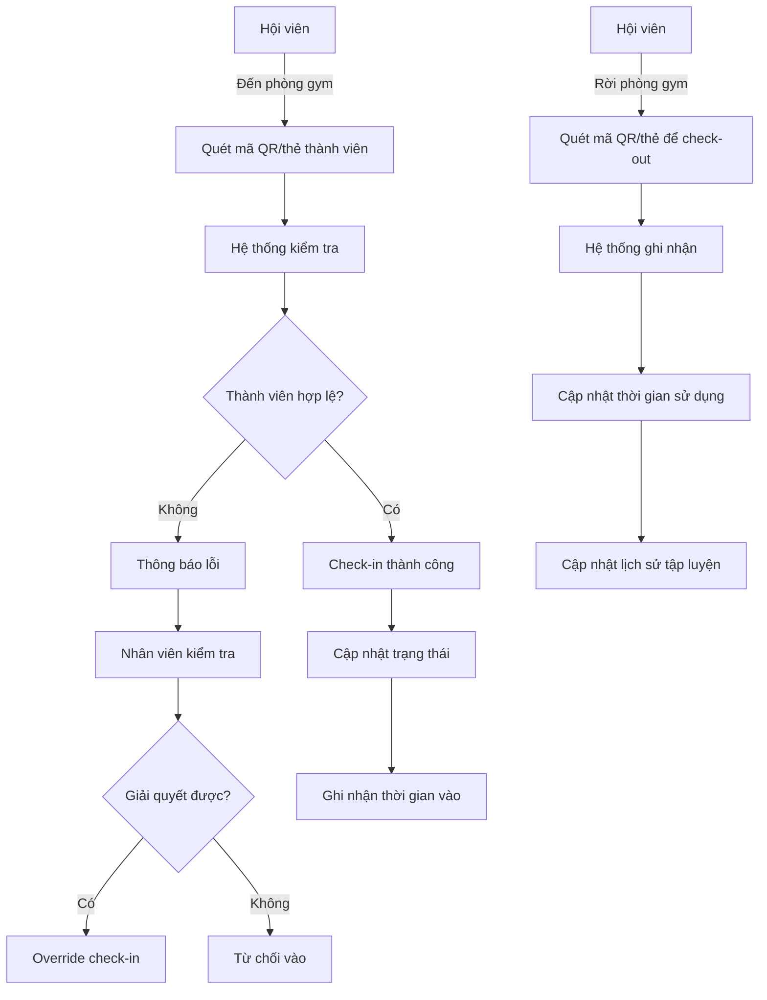

## Quy Trình Thông Báo

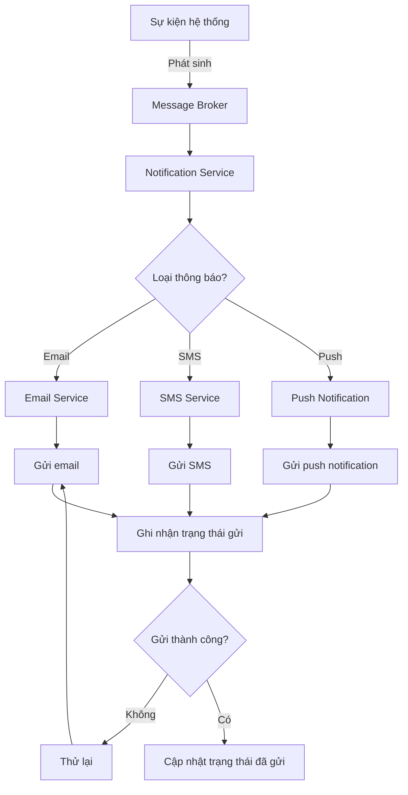

## Quy Trình Báo Cáo và Thống Kê

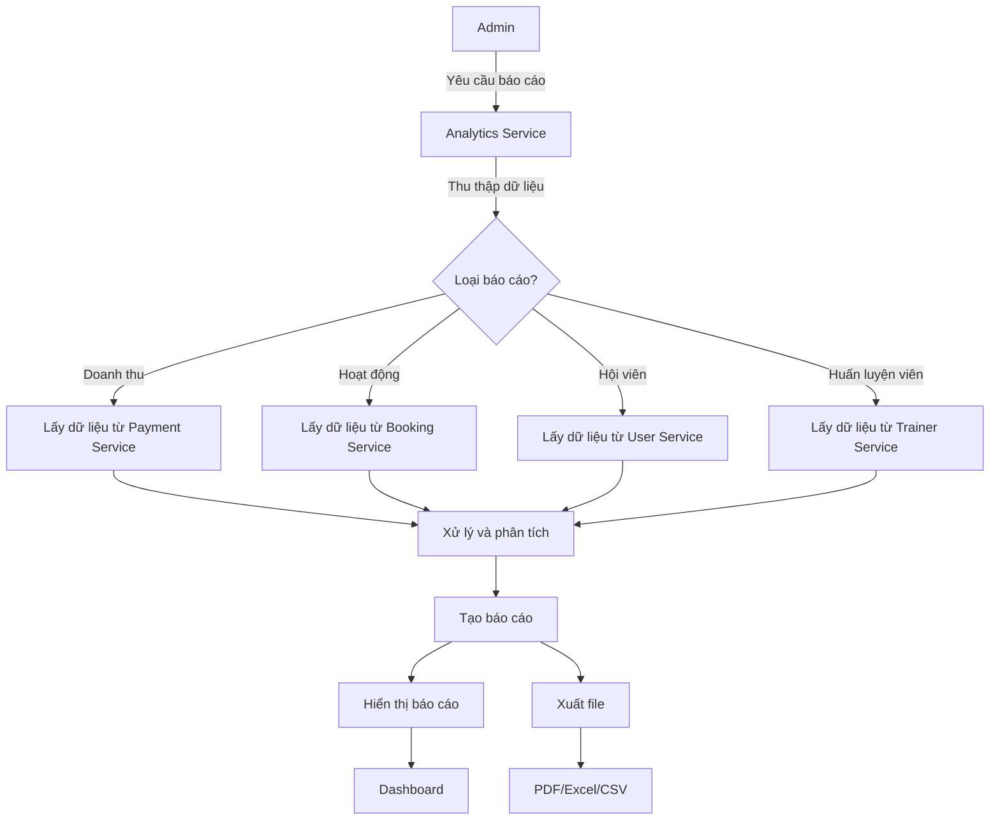

## Tương Tác Giữa Các Microservices

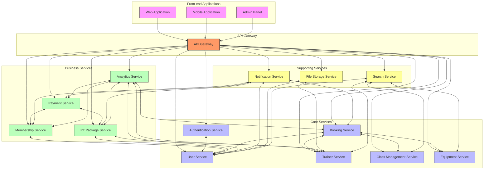

## Diễn Giải Chi Tiết

Hệ thống quản lý phòng gym được thiết kế với kiến trúc microservices để đảm bảo tính linh hoạt, khả năng mở rộng và bảo trì. Mỗi dịch vụ hoạt động độc lập và giao tiếp với nhau thông qua API hoặc Message Broker.

### Các Điểm Chính:

1. **Phân Tách Trách Nhiệm**: Mỗi microservice chịu trách nhiệm cho một phần chức năng cụ thể, giúp dễ dàng phát triển và bảo trì.

2. **Khả Năng Mở Rộng**: Các service có thể được triển khai, mở rộng và nâng cấp độc lập mà không ảnh hưởng đến phần còn lại của hệ thống.

3. **Tính Linh Hoạt**: Hệ thống có thể dễ dàng thêm các tính năng mới thông qua việc thêm microservices hoặc mở rộng các service hiện có.

4. **Xử Lý Sự Cố**: Lỗi trong một service không ảnh hưởng đến toàn bộ hệ thống, giúp tăng độ ổn định và khả năng phục hồi.

Quy trình hoạt động được thiết kế để tối ưu hóa trải nghiệm của cả người dùng cuối (hội viên, huấn luyện viên) và người quản lý (nhân viên, admin), đồng thời đảm bảo tính nhất quán và hiệu quả của dữ liệu.
